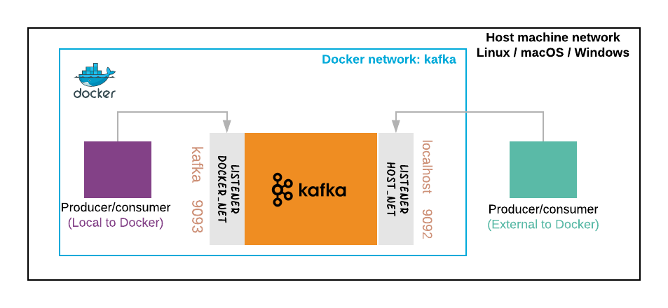

# Apache Kafka docker

## Setting up Kafka and Zookeeper with macOS Docker Desktop

This tutorial provides a step-by-step instruction on how to deploy a Kafka broker with Docker containers when a Kafka producer and consumer sit on different networks.



## Prerequisites

* macOS Docker Desktop

    See [Install Docker Desktop](https://docs.docker.com/docker-for-mac/install/) for download information and installation instructions.

* macOS Python 3.7 (optional)

    Check out my tutorial [mac-dev-setup](https://github.com/mgomesborges/mac-dev-setup) to install Python on your MacBook.

## Setting up Kafka and Zookeeper

We are going to use these two docker images:

* [wurstmeister/kafka](https://hub.docker.com/r/wurstmeister/kafka)
* [wurstmeister/zookeeper](https://hub.docker.com/r/wurstmeister/zookeeper/)

Check out the `docker-compose.yml` file:

```dockerfile
version: '3.8'
services:
  zookeeper:
    image: wurstmeister/zookeeper
    container_name: zookeeper
    networks:
      - kafka_network
    ports:
      - "2181:2181"
  kafka:
    image: wurstmeister/kafka
    container_name: kafka
    networks:
      - kafka_network
    ports:
      - "9092:9092"
    expose:
      - "9093"
    environment:
      KAFKA_LISTENERS: DOCKER_NET://0.0.0.0:9093,HOST_NET://0.0.0.0:9092
      KAFKA_ADVERTISED_LISTENERS: DOCKER_NET://kafka:9093,HOST_NET://localhost:9092
      KAFKA_LISTENER_SECURITY_PROTOCOL_MAP: DOCKER_NET:PLAINTEXT,HOST_NET:PLAINTEXT
      KAFKA_INTER_BROKER_LISTENER_NAME: DOCKER_NET
      KAFKA_ZOOKEEPER_CONNECT: zookeeper:2181
      # Create Kafka topics "NAME:PARTITION:REPLICAS,..."
      KAFKA_CREATE_TOPICS: "topic-container:1:1,topic-macos:1:1"
networks:
  kafka_network:
    name: kafka
    driver: bridge
```

Start Kafka and Zookeeper dockers:

```bash
docker-compose up -d
```

Check if the processes are running:

```bash
docker-compose ps
```

Check Zookeeper logs:

```bash
docker-compose logs zookeeper | grep -i binding
```

Check Kafka broker logs:

```bash
docker-compose logs kafka | grep -i started
```

## Kafka Hello world from Python container

Check out the `Dockerfile` for the Python container:

```dockerfile
FROM python:3.7-alpine

WORKDIR /workspace

ADD ./requirements.txt /workspace
ADD ./produce_consume.py /workspace

RUN pip install --no-cache-dir -r /workspace/requirements.txt
```

Build the Docker image:

```bash
docker build -t kafka-app-py .
```

Run the `produce_consume.py` script inside the Docker container:

```bash
docker run --rm -it --network kafka \
    kafka-app-py:latest \
    python produce_consume.py
```

## Kafka Hello world from macOS

> Check out my tutorial [mac-dev-setup](https://github.com/mgomesborges/mac-dev-setup) to install Python on your MacBook.

Create a Python virtual environment:

```bash
mkvirtualenv kafka
```

Install the requirements:

```bash
pip install kafka-python
```

Run the `produce_consume.py` script from your macOS:

```bash
python produce_consume.py
```

## Clean up everything

Stop Kafka cluster:

```bash
docker-compose down --volumes
```

Remove Docker images:

```bash
docker image rmi \
    kafka-app-py:latest \
    python:3.7-alpine \
    wurstmeister/kafka:latest \
    wurstmeister/zookeeper:latest
```

## References

* [Apache kafka](https://kafka.apache.org)
* [Hello Kafka World! The complete guide to Kafka with Docker and Python](https://medium.com/big-data-engineering/hello-kafka-world-the-complete-guide-to-kafka-with-docker-and-python-f788e2588cfc)
* [Kafka Listeners - Explained](https://www.confluent.io/blog/kafka-listeners-explained/)
* [My Python/Java/Spring/Go/Whatever Client Won’t Connect to My Apache Kafka Cluster in Docker/AWS/My Brother’s Laptop. Please Help!](https://www.confluent.io/blog/kafka-client-cannot-connect-to-broker-on-aws-on-docker-etc/)
* [Deploy a Kafka broker in a Docker container](https://www.kaaproject.org/kafka-docker)
* [GitHub wurstmeister/kafka-docker](https://github.com/wurstmeister/kafka-docker)
* [GitHub wurstmeister/kafka-docker Kafka connectivity](https://github.com/wurstmeister/kafka-docker/wiki/Connectivity)
* [kafka-python client for Apache Kafka](https://github.com/dpkp/kafka-python)
